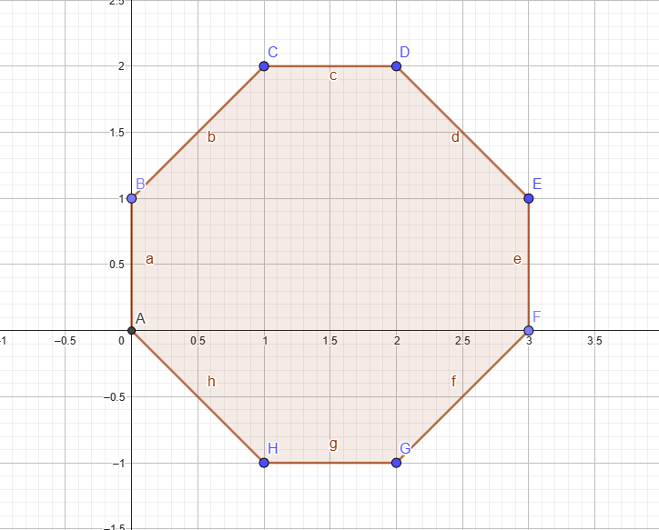

# Poligonos 

## Triangulo

````c++
    vertices[0].Set(0.0f, 0.0f);
    vertices[1].Set(1.0f, 0.0f);
    vertices[2].Set(0.0f, 1.0f);
````

;

---

## Rectangulo

````c++
    verticesRec[0].Set(0.0f, 0.0f);
    verticesRec[1].Set(1.0f, 0.0f);
    verticesRec[2].Set(1.0f, 3.0f);
    verticesRec[3].Set(0.0f, 3.0f);
````


---

## Cuadrado

````c++
    verticesSquare[0].Set(0.0f, 0.0f);
    verticesSquare[1].Set(1.0f, 0.0f);
    verticesSquare[2].Set(1.0f, 1.0f);
    verticesSquare[3].Set(0.0f, 1.0f);
````


---

## Pentagono

````c++
    verticesPent[0].Set(0.0f, 0.0f);
    verticesPent[1].Set(-0.5f, 1.0f);
    verticesPent[2].Set(0.5f, 1.5f);
    verticesPent[3].Set(1.5f, 1.0f);
    verticesPent[4].Set(1.0f, 0.0f);
````


---

## Hexagono 

````c++
    verticesHexagon[0].Set(0.0f, 0.0f);
    verticesHexagon[1].Set(1.0f,  0.5f);
    verticesHexagon[2].Set(1.0f, 1.5f);
    verticesHexagon[3].Set(0.0f, 2.0f);
    verticesHexagon[4].Set(-1.0f, 1.5f);
    verticesHexagon[5].Set(-1.0f, 0.5f);
````


---

## Octagono 

````c++
    verticesOctagon[0].Set(0.0f, 0.0f);
    verticesOctagon[1].Set(1.0f, 0.0f);
    verticesOctagon[2].Set(2.0f, 1.0f);
    verticesOctagon[3].Set(2.0f, 2.0f);
    verticesOctagon[4].Set(1.0f, 3.0f);
    verticesOctagon[5].Set(0.0f, 3.0f);
    verticesOctagon[6].Set(-1.0f, 2.0f);
    verticesOctagon[7].Set(-1.0f, 1.0f);
````

